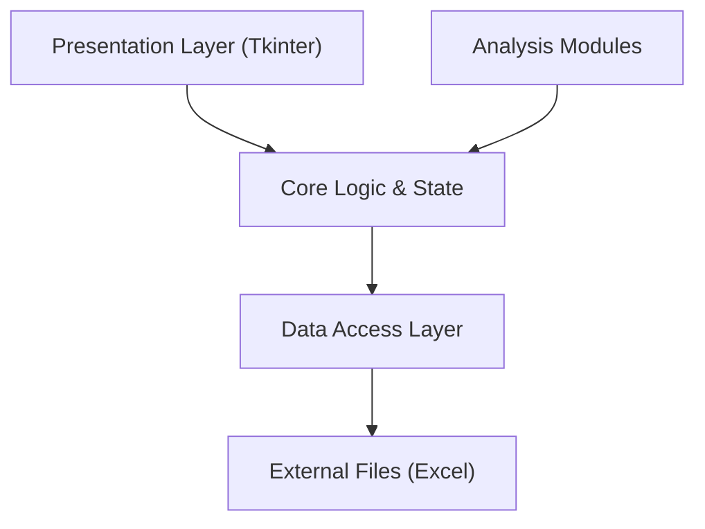

# DataScope Professional V2 🔬


**DataScope** is an enterprise-grade data analysis suite designed for the comprehensive study of railway station networks. Built with a strict **Clean Architecture**, it leverages advanced Machine Learning and Cybersecurity algorithms to transform raw operational data into actionable strategic insights.

---

## 🚀 Key Features

### 📊 Advanced Analytics
- **Principal Component Analysis (PCA):** Dimensionality reduction to identify key performance drivers in station traffic and satisfaction data.
- **Correspondence Analysis (CA/AFC):** Qualitative analysis mapping the relationship between geographical regions and service typologies.

### 🤖 Artificial Intelligence
- **Clustering (K-Means):** Automatic segmentation of railway stations into homogeneous performance groups.
- **Predictive Modeling (Random Forest):** Machine Learning classification for new station onboarding.

### 🛡️ Cybersecurity
- **Anomaly Detection:** Implementation of **Isolation Forest** and **LOF (Local Outlier Factor)** to detect statistical irregularities and potential security threats in network data.

---

## 🛠️ Technical Architecture

The project adheres to **Clean Architecture** principles to ensure modularity, testability, and maintainability.



- **`src/core/`**: Central nervous system handling application state and protocols.
- **`src/data/`**: Robust ETL pipeline for loading, cleaning, and normalizing datasets.
- **`src/modules/`**: Decoupled analysis engines (PCA, Clustering, Security).
- **`src/ui/`**: Premium, responsive interface system built on Tkinter.

## 📦 Installation

1.  **Clone the repository**
    ```bash
    git clone https://github.com/YourUsername/DataScope.git
    cd DataScope
    ```

2.  **Set up the environment**
    ```bash
    python -m venv venv
    # Windows
    venv\Scripts\activate
    # macOS/Linux
    source venv/bin/activate
    ```

3.  **Install dependencies**
    ```bash
    pip install -r requirements.txt
    ```

## 🖥️ Usage

Launch the professional dashboard:

```bash
python main.py
```

The application will launch in full-screen mode. Select your dataset (standard templates provided in `data/`) to unlock analysis modules.

